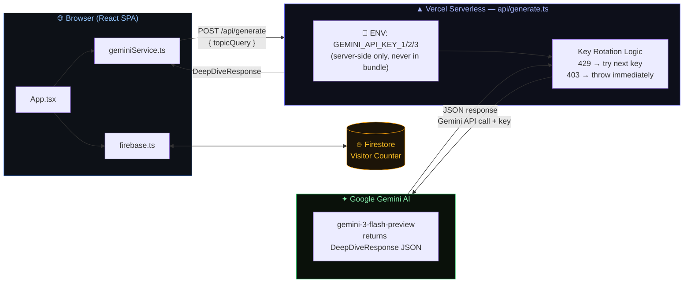

# iOS Prep — Interview Coach

> AI-powered study tool for iOS engineering interviews. Built for developers preparing for roles at Apple, Airbnb, Uber, and other top companies.

**Live:** [ios-prep-interview-coach.vercel.app](https://ios-prep-interview-coach.vercel.app)

---

## What It Does

Select any iOS topic and get a complete, production-quality study session generated by Gemini AI:

- **Deep Dive** — thorough markdown explanation with mental models, code comparisons, and edge cases
- **Interactive Quiz** — 4 multiple-choice questions with scored feedback
- **Code Examples** — 3 progressive Swift examples (basic → intermediate → advanced)
- **Interview Gold** — what top-company interviewers are actually testing
- **Common Mistakes** — what costs candidates the offer
- **Memory Diagrams** — visual graphs for ARC, retain cycles, and architecture patterns

---

## Topics Covered

| Category | Topics |
|---|---|
| **Swift Language** | Value vs Reference Types, Protocols & POP, Generics, Closures & Escaping, Optionals & Error Handling, Codable |
| **SwiftUI** | State Management, View Lifecycle, Layout System |
| **UIKit** | ViewController Lifecycle, TableView & CollectionView, Auto Layout |
| **Architecture** | MVVM, Coordinator Pattern, Dependency Injection |
| **Performance & Concurrency** | Memory Management (ARC), GCD vs Combine, Swift Concurrency (Async/Await) |
| **Data & Storage** | Core Data & SwiftData, URLSession & Networking |
| **Testing** | Unit & UI Testing |

---

## Tech Stack

| Layer | Technology |
|---|---|
| Frontend | React 19, TypeScript, Vite 6 |
| Styling | Tailwind CSS, custom dark OLED theme with glassmorphism |
| AI | Google Gemini (`gemini-3-flash-preview`) via serverless proxy |
| Backend | Vercel Serverless Functions (`api/generate.ts`) |
| Database | Firebase Firestore (live visitor counter) |
| Deployment | Vercel (auto-deploy on push) |

---

## Architecture




**API keys never reach the browser.** The serverless function holds `GEMINI_API_KEY_1/2/3` as server-side environment variables. Key rotation automatically falls back to the next key on rate limits (429), but stops and throws on invalid keys (403).

---

## Local Development

### Prerequisites

- Node.js 18+
- A [Vercel account](https://vercel.com) (free)
- Gemini API keys from [Google AI Studio](https://aistudio.google.com)

### Setup

```bash
git clone https://github.com/shaikat1993/iOS-Prep-Interview-Coach
cd iOS-Prep-Interview-Coach
npm install
```

Create a `.env` file in the project root:

```env
GEMINI_API_KEY_1=your_key_here
GEMINI_API_KEY_2=your_key_here
GEMINI_API_KEY_3=your_key_here
```

> The keys use no `VITE_` prefix — they are server-side only and never bundled into the browser.

### Run

```bash
npm run start
```

This runs `vercel dev`, which starts both the Vite frontend and the `api/` serverless functions together on `http://localhost:3000`.

> Do not use `npm run dev` — that starts Vite alone without the API functions, so Gemini calls will fail.

---

## Deployment

The project auto-deploys to Vercel on every push to `master`.

### First-time setup

1. Push the repo to GitHub
2. Import the project at [vercel.com](https://vercel.com) → New Project
3. Add environment variables in **Settings → Environment Variables**:

```
GEMINI_API_KEY_1 = your_key_1
GEMINI_API_KEY_2 = your_key_2
GEMINI_API_KEY_3 = your_key_3
```

4. Deploy — done.

### Manual deploy

```bash
./node_modules/.bin/vercel --prod
```

---

## Project Structure

```
├── api/
│   └── generate.ts          # Vercel serverless function — Gemini proxy with key rotation
├── components/
│   ├── CodeExamplesSection.tsx
│   ├── InterviewInsightsSection.tsx
│   ├── MarkdownRenderer.tsx
│   ├── MemoryDiagram.tsx
│   └── QuizSection.tsx
├── services/
│   └── geminiService.ts     # Client — calls /api/generate
├── App.tsx                  # Main app, topic list, tab layout
├── constants.tsx            # All 20 topic definitions
├── firebase.ts              # Firestore visitor counter
├── types.ts                 # TypeScript interfaces
├── index.css                # Dark OLED theme, glassmorphism, animations
├── tailwind.config.js       # Custom colors, shadows, keyframes
└── vercel.json              # Vercel build config
```

---

## Security

- API keys are stored in Vercel's encrypted environment — never in the repo or browser bundle
- `.env` is in `.gitignore` and will never be committed
- The browser only calls `/api/generate` (your own endpoint), never Gemini directly
- No user data is stored or logged

---

## Scripts

| Command | Description |
|---|---|
| `npm run start` | Local dev with Vercel (frontend + API functions) |
| `npm run build` | Production build to `dist/` |
| `npm run lint` | TypeScript type check |
| `npm run preview` | Preview production build locally |
